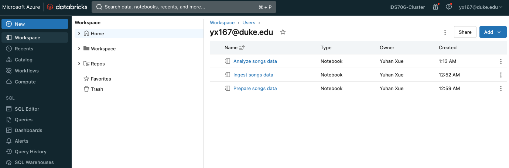

# IDS706-Databricks-Pipeline-YuhanXue

This project is about how to create and deploy an end-to-end data processing pipeline, including how to ingest raw data, transform the data, and run analyses on the processed data. The dataset used in this project is a subset of the Million Song Dataset, and procedure follows [this tutorial](https://learn.microsoft.com/en-us/azure/databricks/getting-started/data-pipeline-get-started).

[](https://github.com/nogibjj/IDS706-Databricks-Pipeline-XS110/actions/workflows/cicd.yml)


## Step 1: Cluster

In the compute module, I created a cluster in my Azure Databricks workspace by using the Azure Databricks portal.


## Step 2: ETL Notebook

3 notebooks are created to perform ETL.

- Create a Databricks notebook `Ingest song data` to ingest raw source data and write the raw data to a target table.
``` python
from pyspark.sql.types import DoubleType, IntegerType, StringType, StructType, StructField

# Define variables used in the code below
file_path = "/databricks-datasets/songs/data-001/"
table_name = "raw_song_data"
checkpoint_path = "/tmp/pipeline_get_started/_checkpoint/songss_data"

schema = StructType(
  [
    StructField("artist_id", StringType(), True),
    StructField("artist_lat", DoubleType(), True),
    StructField("artist_long", DoubleType(), True),
    StructField("artist_location", StringType(), True),
    StructField("artist_name", StringType(), True),
    StructField("duration", DoubleType(), True),
    StructField("end_of_fade_in", DoubleType(), True),
    StructField("key", IntegerType(), True),
    StructField("key_confidence", DoubleType(), True),
    StructField("loudness", DoubleType(), True),
    StructField("release", StringType(), True),
    StructField("song_hotnes", DoubleType(), True),
    StructField("song_id", StringType(), True),
    StructField("start_of_fade_out", DoubleType(), True),
    StructField("tempo", DoubleType(), True),
    StructField("time_signature", DoubleType(), True),
    StructField("time_signature_confidence", DoubleType(), True),
    StructField("title", StringType(), True),
    StructField("year", IntegerType(), True),
    StructField("partial_sequence", IntegerType(), True)
  ]
)

(spark.readStream
  .format("cloudFiles")
  .schema(schema)
  .option("cloudFiles.format", "csv")
  .option("sep","\t")
  .load(file_path)
  .writeStream
  .option("checkpointLocation", checkpoint_path)
  .trigger(availableNow=True)
  .toTable(table_name)
)
```
- Data sink: create a Databricks notebook `Prepare song data` to transform the raw source data and write the transformed data to a target table.
```sql
%sql
CREATE OR REPLACE TABLE
  Prepare_songs_data (
    artist_id STRING,
    artist_name STRING,
    duration DOUBLE,
    release STRING,
    tempo DOUBLE,
    time_signature DOUBLE,
    title STRING,
    year DOUBLE,
    processed_time TIMESTAMP
  );

INSERT INTO
  Prepare_songs_data
SELECT
  artist_id,
  artist_name,
  duration,
  release,
  tempo,
  time_signature,
  title,
  year,
  current_timestamp()
FROM
  raw_song_data
```

- Create a Databricks notebook `Analyze song data` to query the transformed data.

```sql
%sql
-- Which artists released the most songs each year?
SELECT
  artist_name,
  count(artist_name)
AS
  num_songs,
  year
FROM
  prepare_songs_data
WHERE
  year > 0
GROUP BY
  artist_name,
  year
ORDER BY
  num_songs DESC,
  year DESC;

 -- Find songs for your DJ list
 SELECT
   artist_name,
   title,
   tempo
 FROM
   prepare_songs_data
 WHERE
   time_signature = 4
   AND
   tempo between 100 and 140;
```





## Step 3: Pipeline / Workflow


To automate the data pipeline with a Databricks job, a workflow `Song_workflow` was created.


## Results

Partial results for the first query:


Partial results for the second query:

